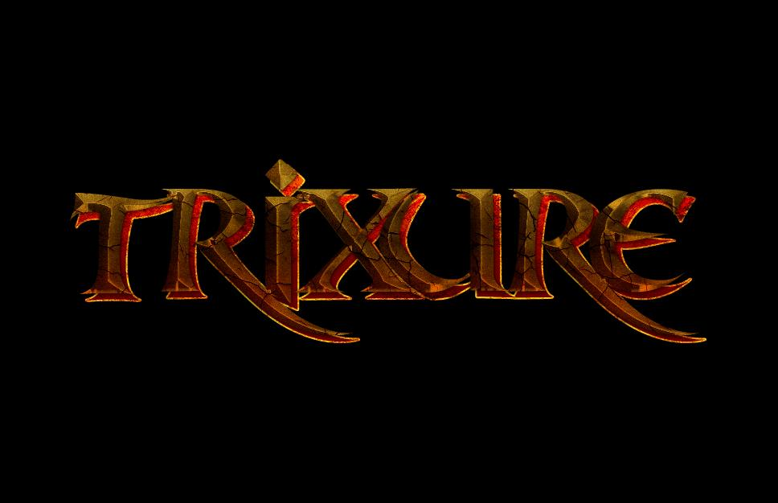
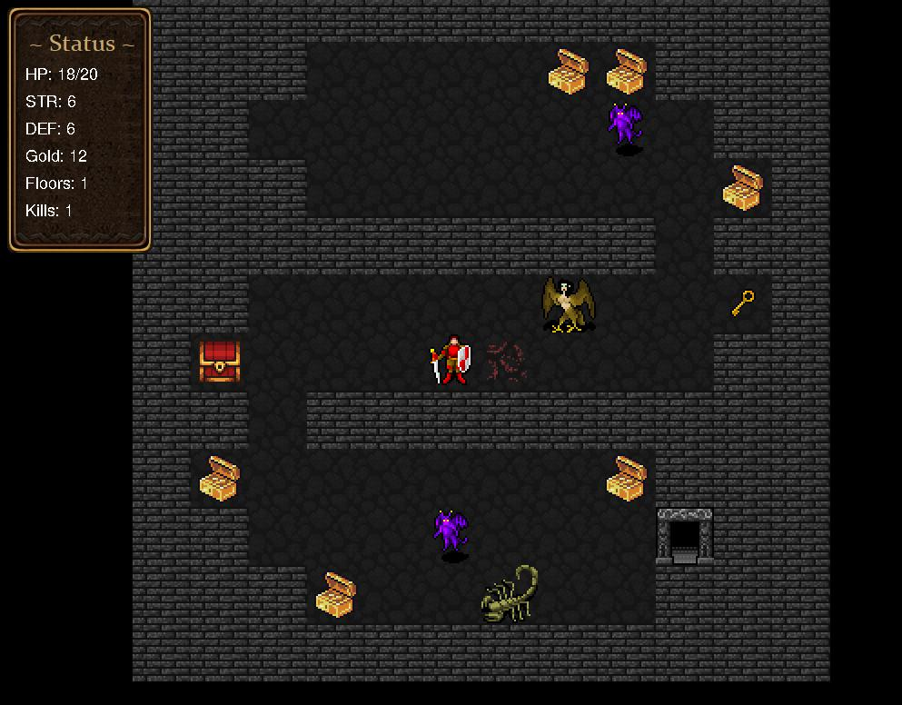
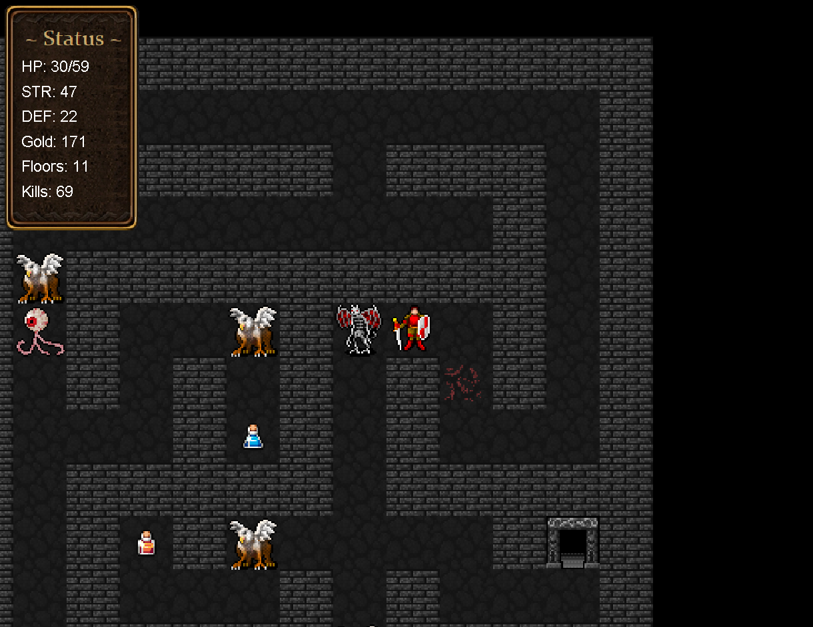
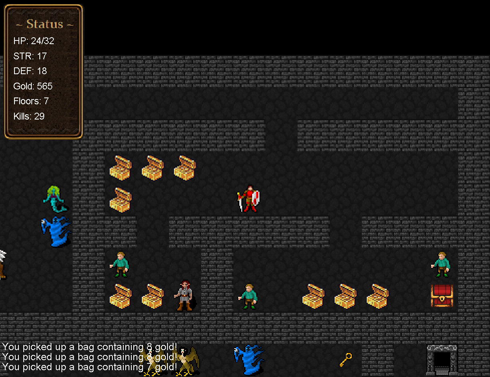
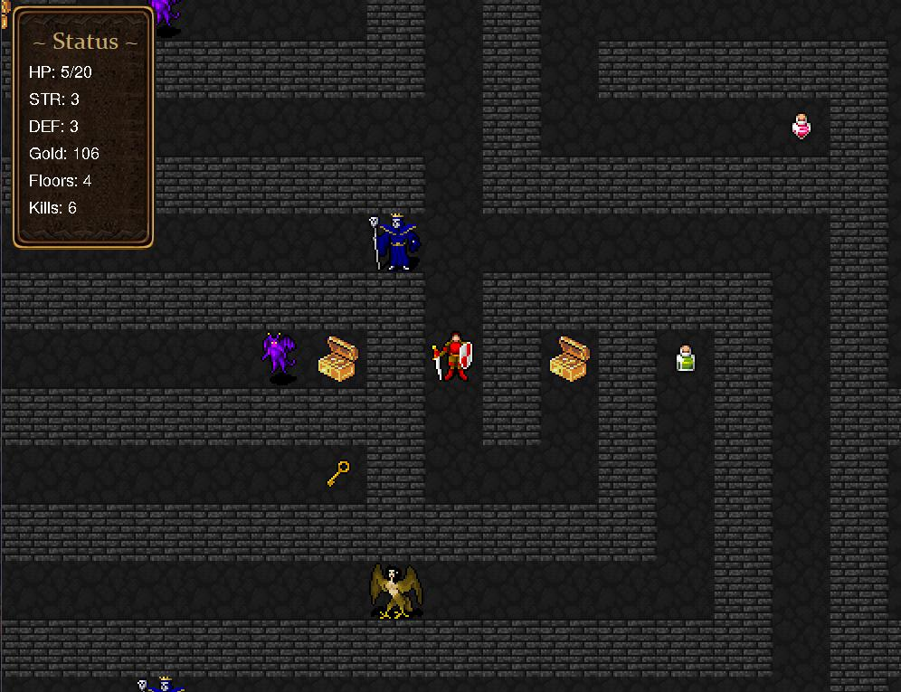
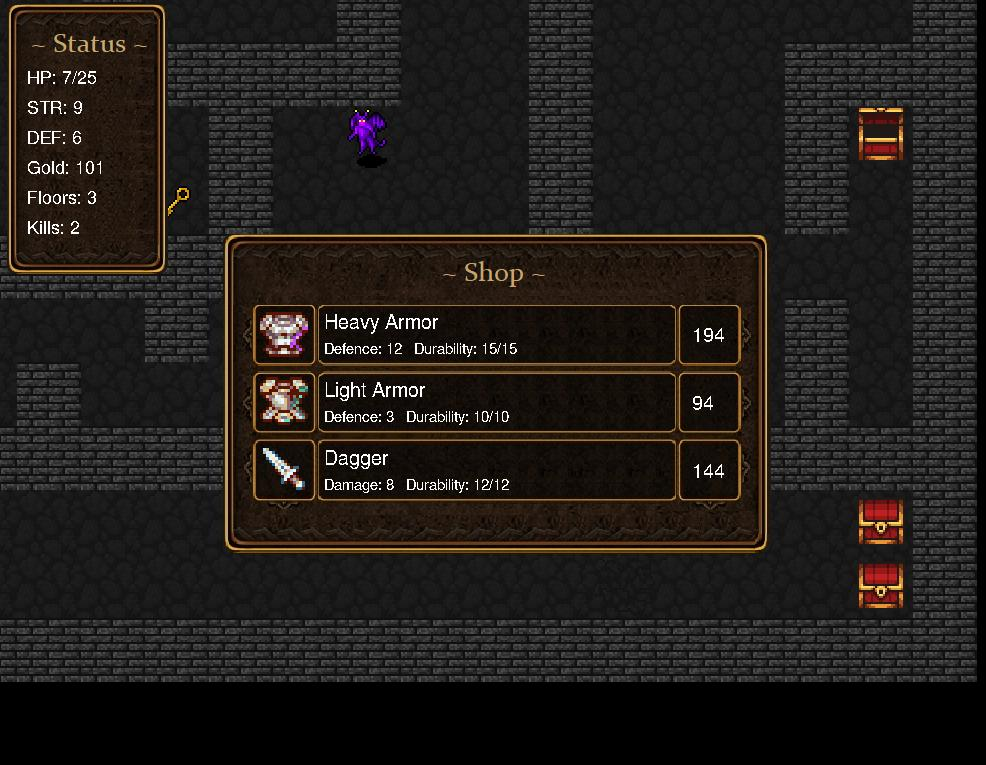
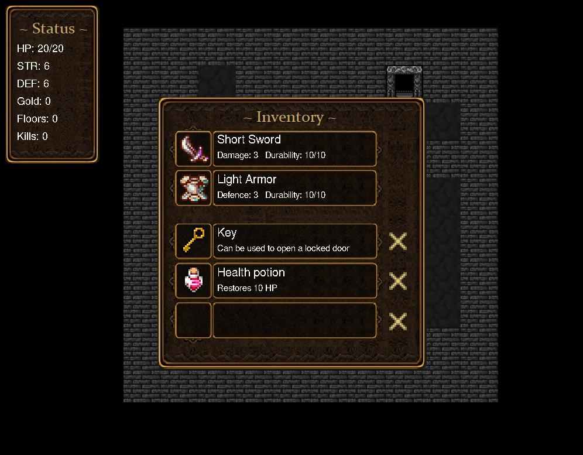
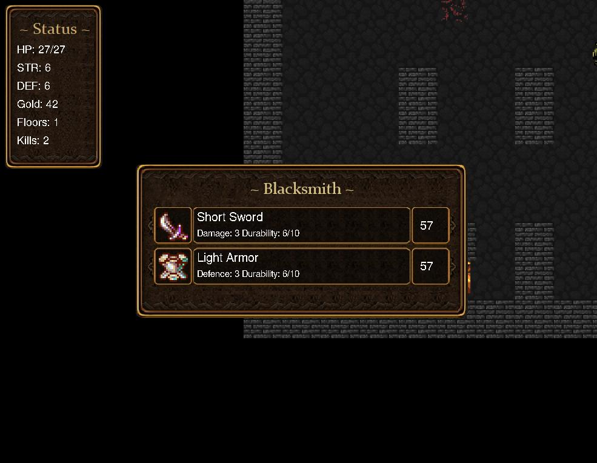
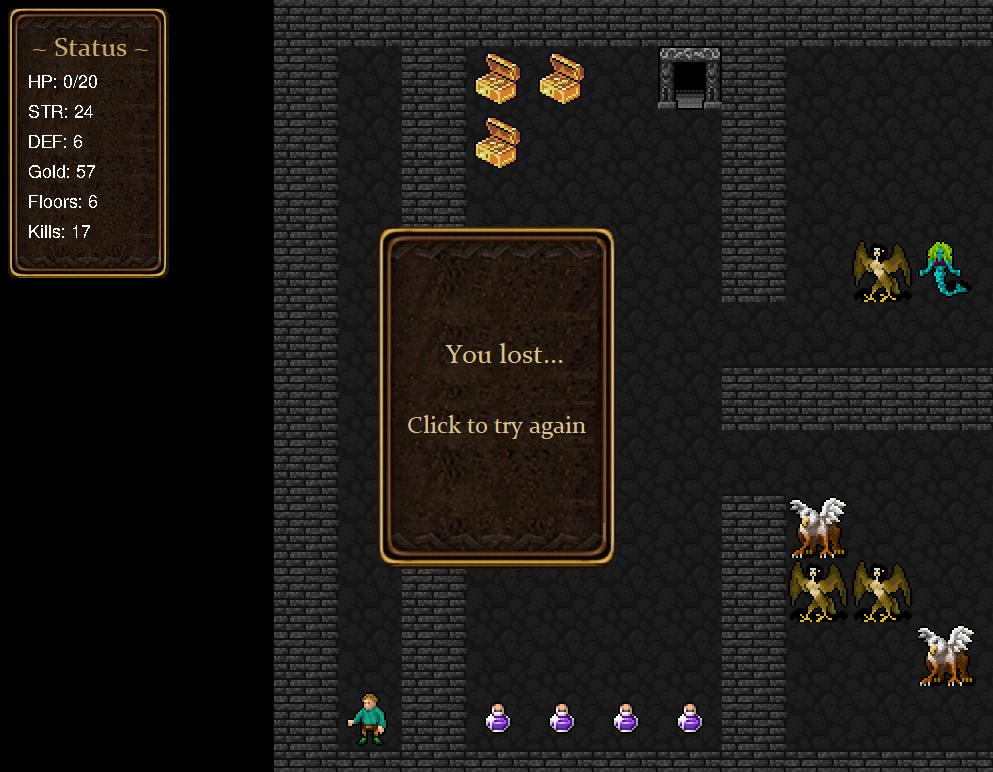

# Trixure

"Trixure" is a simple roguelike game where the player takes on the role of a fearless adventurer. They traverse a mysterious dungeon full of dangers and countless rooms, uncovering secrets and treasures.

The map consists of a series of randomly generated rooms, meaning each journey through the labyrinth is unique. The player's goal is to reach the depths of the dungeon, where a powerful boss awaits, holding the key to success. However, the path to achieving this goal is fraught with peril.

The player starts the game as an adventurer with basic abilities. During the exploration of rooms, they will come across various items and equipment that can enhance their strength or provide new skills. This may include weapons, armor or potions, offering additional bonuses or special abilities. The player must strategically choose which items to collect, as they directly impact the character's statistics and combat abilities.

While exploring rooms, the player will encounter various enemies who will attack them. This initiates combat, where the player must use their skills to defeat the enemies. Success in combat is rewarded with gold, which can be used to develop the character.

Will you be able to navigate the labyrinth, defeat the boss, and find the legendary treasure? Only the bravest and most skilled players can find out.

# How to run?

For example, in VSCode, run from the main folder (Trixure) using Run Java from the Extension Pack for Java.

# How to play?

It's simple! When you see the start screen, press a button to begin (one of them is A).

Controls:

- Movement (WASD)
- Open/close inventory (Q)
- Pick up item from the floor/open chest (E)
- Trade with the shopkeeper/blacksmith (T)

# Screenshots

